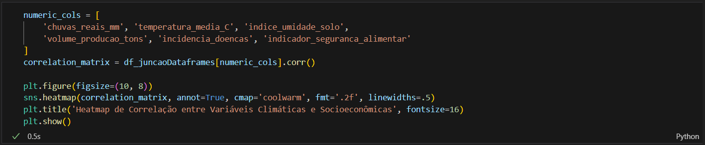

# Relatório da tarefa individual III: Desafio dos recursos hídricos e produtividade na Amazônia. 
## Curso: i2a2 – Institut d’Intelligence Artificielle Appliquée 
## Aluno: Jhoann Carllos Feitosa Araújo 
## Professor: Onédio Seabra Jr. 
 
Cenário: Conforme descrito, comunidades ribeirinhas e agricultores familiares na Amazônia enfrentam uma crise hídrica, marcada por estiagens e enchentes, que impacta a segurança alimentar e a qualidade de vida. Há uma percepção de que as mudanças climáticas e a qualidade da água afetam a produtividade agrícola.

Problema Central: Líderes comunitários buscam validar suas percepções com dados, a fim de entender a relação real entre as variações climáticas, os desafios hídricos, a produtividade agrícola e a segurança alimentar em suas comunidades. 

Objetivo: Realizar uma Análise Exploratória de Dados (EDA) para transformar os dados brutos (base_climatica.csv e base_socioeconomica.csv) em informações confiáveis. O objetivo é identificar padrões, validar hipóteses e gerar insights que possam subsidiar a tomada de decisão das lideranças comunitárias.

## Fazendo a Limpeza Dos Dados.

Na primeira célula de código, eu começo importando as bibliotecas “pandas” que é a 
mais utilizada e recomendada para a análise de dados, e para a criação dos gráficos, eu 
importo as bibliotecas “matplotlib”, “numpy” e “seaborn”.
 

Logo em seguida, eu uso o método “read.csv()” para ler os dataframes “base_climatica.csv” e “base_socioeconomica.csv”, já informando que o separador das colunas é a “,”. 

 
A partir daqui, já temos tudo pronto para o tratamento dos dados. Como tivemos diferentes agentes coletando dados, alguns podem ter coletado as mesmas informações, o que possivelmente pode ocasionar em linhas duplicadas em nosso dataframe. Para evitar isso, eu utilizei a função “drop_duplicates()”, ela irá remover todas as possíveis linhas duplicadas do nosso dataframe. 

 
O próximo passo é mudar os tipos das colunas, mas por que fazer isso? A resposta é bem simples, não queremos uma coluna de datas ou chuvas previstas em milímetros no formato de string. Para isso, eu peguei cada coluna de cada dataframe eu mudei o seu tipo. No dataframe “base_climatica.csv” eu mudei a coluna “data” para o formato “datetime” utilizando a função “to_datetime” da biblioteca pandas. As colunas “chuvas_previstas_mm”, “chuvas_reais_mm”, “temperatura_media_C” e “índice_umidade_solo” foram convertidas para “float” utilizando a função “astype()”. Por fim, a coluna “variação_climatica” foi convertida para “string”, também utilizando a função “astype()”.

No dataframe “base_socioeconomica.csv”, as mudanças feitas foram: coluna “data” para “datetime”, colunas “volume_producao_tons”, “incidencia_doencas” e “indicador_seguranca_alimentar” para “float” e coluna “acesso_agua_potavel” para “string”. 
Essas mudanças são essenciais para o tratamento dos nossos dataframes. Essa é uma etapa crucial para posteriormente, se os dataframes forem utilizados para consultas ou quando formos juntar as tabelas.

Como a coleta foi feita por diferentes agentes, ainda podemos ter possíveis mudanças a fazer no dataframe. Cada agente pode ter uma forma de grafia ou pode ter cometido um erro de grafia, algum pode ter se precipitado e ter colocado alguma informação 
muito incoerente para aquela coluna, e também, algum agente pode ter deixado de colocar algum valor no dataframe. 
No dataframe “base_climática” eu percebi algumas informações incoerentes nas colunas “chuvas_previstas_mm” e “chuvas_reais_mm” como valores negativos ou acima de 200mm. Eu resolvi trocar esses valores pela mediana da coluna, desta forma 
não temos os dados precisos, mas temos dados muito menos incoerentes. Para resolver isso, primeiro eu troquei todos os valores negativos e todos os valores acima de 200mm para “nan”, ou seja, todos esses valores foram removidos das 
colunas deixando os espaços em branco. Depois, eu tirei a mediana das colunas utilizando a função “median()”. Após isso, foi só substituir todos os valores “nan” para os valores das medianas, para fazer isso eu utilizei a função “fillna()”.

Também foram encontradas informações precipitadas e incoerentes nas colunas “temperatura_media_C” e “índice_umidade_solo”. Na coluna “temperatura_media_C”, eu substitui todos os valores abaixo de 20 e acima de 35 para “nan” e na coluna “índice_umidade_solo” os valores abaixo de 10 e acima de 90 também foram substituídos para “nan”. Após isso eu tirei a mediana das colunas e substituí todos os valores “nan” para as suas respectivas medianas. Além da substituição de valores incoerentes, todas as linhas dessas colunas que já não tinham valores foram substituídas para as medianas de suas colunas. Esse tipo de tratamento enriquece o dataframe e ajuda muito em futuras pesquisas.

 
O dataframe “base_socioeconomica” também continha alguns dados incoerentes. Na coluna “volume_producao_tons” eu troquei todos os valores abaixo de 0.5 e acima de 20 para “nan” e na coluna “incidência_doencas”, eu troquei todos os valores abaixo de 
0 e acima de 10 para “nan” e também arredondei todos os valores quebrados. Na coluna “indicador_seguranca_alimentar”, eu troquei todos os valores abaixo de 0 e acima de 100 para “nan” também. 
Após isso, foi só tirar a mediana de todas as colunas e substituir todos os valores “nan” para a mediana de cada coluna. 

 
Durante a coleta de dados, alguns agentes também cometeram alguns erros de grafia ou tem um tipo de grafia diferente. Na coluna “variação_climatica” do dataframe “base_climatica” e na coluna “acesso_agua_potavel” do dataframe “base_socio_economica” contem apenas os valores “sim” e não” teoricamente, mas eu encontrei algumas linhas diferentes como “Sim”, “Não”, “Nao” e “nao”. Para 
resolver isso eu utilizei a função “str.lower()” nas duas colunas, essa função deixou todas as linhas das duas colunas em letras minúsculas. Também, utilizei a função “replace()” para trocar tudo que era “nao” para “não”. Agora, as duas colunas dos dataframes estão padronizadas. 
 
 
 
Agora, os dois dataframes estão limpos e tratados, prontos para serem juntos e receberem prováveis consultas. Antes de começar a fazer os gráficos, eu salvei os dois dataframes tratados em novos arquivos csv. 
 
 ## Criando Gráficos.
 
Para começar a criar os gráficos, primeiro foi preciso juntar as duas tabelas. Aqui foi feito um inner join através da coluna data, isso foi feito através da função “merge()” da biblioteca pandas. 
 

 
O primeiro gráfico compara as chuvas previstas com as chuvas reais. Algumas perguntas que podem surgir são perguntas do tipo:

• A previsão de chuvas tem sido precisa ao longo do período analisado? 
• Houve períodos específicos de seca extrema ou de chuvas muito acima do normal que poderiam ter impactado a agricultura? 
• A comunidade pode confiar nas previsões para planejar o plantio e a colheita, ou existe um alto grau de incerteza climática?

 
Este gráfico nos ajuda a entender o contexto climático. Ele não apenas oferece o volume de chuvas reais que a natureza oferece, mas também avalia as chuvas que estão previstas. Uma grande diferença entre a chuva real e a prevista indica incerteza, um risco enorme para agricultores. O gráfico estabelece a base para investigar o impacto desses eventos climáticos extremos. O script utilizado para criar o gráfico foi o seguinte: 

 
O segundo gráfico que criei foi um heatmap de correlação. Este mapa de calor oferece uma visão panorâmica e quantitativa da força da relação linear entre todas as variáveis numéricas do estudo. 
O tipo de pergunta que esse gráfico pode responder são perguntas do tipo:

• Quais são os fatores climáticos que mais parecem influenciar o volume de produção agrícola e a segurança alimentar? 
• Existe alguma relação inesperada entre as variáveis? Por exemplo, a temperatura se correlaciona com a incidência de doenças? 
• Quais relações parecem mais fortes e merecem ser investigadas mais a fundo com um gráfico de dispersão? 

 
O heatmap permite identificar rapidamente as conexões mais promissoras para uma análise detalhada, economizando tempo. Se o quadrado que cruza “índice_umidade_solo” e “indicador_seguranca_alimentar for de cor forte, isso gera a hipótese de que a umidade do solo é um fator crítico para a segurança alimentar. Ele direciona a investigação, apontando quais variáveis tem maior probabilidade de influenciar umas as outras.

O script utilizado para a criação do gráfico foi o seguinte: 

 
O terceiro gráfico foi um gráfico de dispersão do clima vs. a segurança alimentar. Este gráfico foca em uma relação específica e crucial, mostrando cada ponto de dado da relação entre o volume de chuvas e o indicador de segurança alimentar. 
As perguntas que esse gráfico pode responder são perguntas do tipo:

• Como exatamente o volume de chuvas impacta o indicador de segurança alimentar? A relação é positiva, negativa ou nula? 
• Podemos observar um “ponto ideal” de chuva? A falta ou o excesso de chuva demonstram visualmente um impacto negativo na segurança alimentar? 
• A relação é consistente para todos os pontos ou é muito dispersa, sugerindo que outros fatores também são importantes?

 
Enquanto o heatmap fornece um único número, o gráfico de dispersão revela a natureza e a forma da relação. Ele permite validar a hipótese gerada pelo heatmap de maneira visual. Por exemplo, a relação pode não ser uma linha reta: talvez um pouco 
de chuva ajude muito, mas chuva em excesso comece a prejudicar a segurança alimentar. Ele aprofunda a análise, mostrando o padrão de impacto direto de uma variável climática chave no bem-estar da comunidade. 
O script utilizado para a criação do gráfico foi o seguinte: 
 

O ultimo gráfico também foi um gráfico de dispersão, nesse foi feita uma análise integrada com identificação de clusters. Este é o gráfico mais sofisticado, pois analisa a relação entre umidade do solo e segurança alimentar, mas adiciona uma terceira 
dimensão: o acesso à água potável, diferenciado por cores. 
As perguntas que esse gráfico pode responder, são perguntas do tipo:

• O acesso à água potável muda a forma como as variações climáticas afetam a segurança alimentar das famílias? 
• Podemos identificar dois “clusters” de comportamento distintos: um para as comunidades com acesso à água e outro para as que não tem? 
• As comunidades com acesso à água são mais resilientes? Ou seja, o indicador de segurança alimentar delas se mantem mais estável mesmo quando a umidade do solo varia muito?

 
Este gráfico é a chave para revelar padrões ocultos e complexos. Ele vai além do “o que” e começa a explorar o “porquê”. Ao segmentar os dados, ele pode mostrar que o impacto do clima não é uniforme para todos. A descoberta de dois clusters distintos 
provaria que fatores socioeconômicos podem moderar o impacto climático. Isso é fundamental para a tomada de decisão, pois sugere que soluções para a insegurança alimentar não devem focar apenas em técnicas agrícolas, mas também em investimentos em infraestrutura básica, como o acesso à água, para aumentar a resiliência da comunidade. 
O script utilizado para a criação do gráfico foi o seguinte:

 
Fim da atividade!